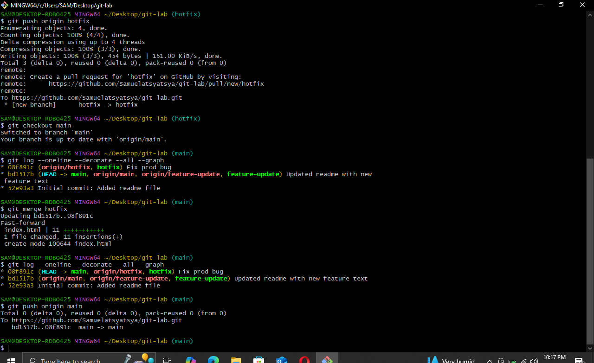
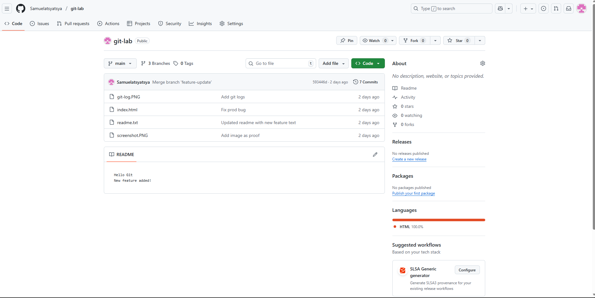
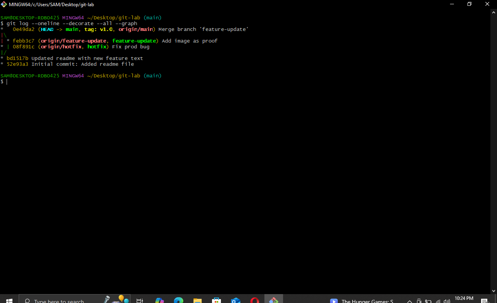

In this lab, I practiced using Git to manage source code. 
I configured Git, created a repository, made commits, created and merged a branch, and finally pushed everything to GitHub. 
This helped me understand the basic workflow that developers use every day.

Task 1: Configure Git

I started by setting my global username and email:

git config --global user.name "My Name"

git config --global user.email "my@email.com"

Then I confirmed the settings with:

git config --global --list

Result: Git recognized my username and email, meaning the configuration was successful.

Task 2: Initialize a Local Repository

I created a new folder named git-lab and moved into it.
Then I ran:

git init

Result: A new, empty Git repository was successfully initialized in the folder.

Task 3: Create My First Commit

I created a file called readme.txt with the text “Hello Git!”
I checked the status using:

git status

Then I added it to staging:

git add readme.txt

And committed it:

git commit -m "Initial commit: Added readme file"

Result: My very first commit was created.

Task 4: Create and Work on a Branch

Next, I made a new branch called feature-update:

git branch feature-update

I switched to it:

git checkout feature-update

I added another line to readme.txt, staged it, and committed the change.

Result: The feature branch contained updates separate from the main branch.

Task 5: Merge the Branch Back Into Main

I switched back to the main branch:

git checkout main

Then I merged the feature branch:

git merge feature-update

Result: The changes from my feature branch were successfully merged into main.

Task 6: Connect to GitHub

I created a GitHub repo named git-lab, then added it as a remote using:

git remote add origin https://github.com/Samuelatsyatsya/git-lab.git

Finally, I pushed my main branch:

git push -u origin main

Result: All my local work appeared online in my GitHub repository.

Task 7: View Commit History

To finish, I viewed my project’s commit history using:

git log --oneline --graph

Result: Git showed my commits and the branch merge clearly.

3. Deliverables I Completed

I created a local Git repository
I made more than one commit
I created and merged a feature branch
I pushed everything to GitHub
I demonstrated understanding of staging, committing, branching, merging, and pushing

4. Optional Challenges (Attempted)
Undo a commit:

git revert

By completing this lab, I now understand the full workflow of using Git—from starting a project locally to collaborating through GitHub. 
This has strengthened my confidence in version control again, and basic developer workflow practices.